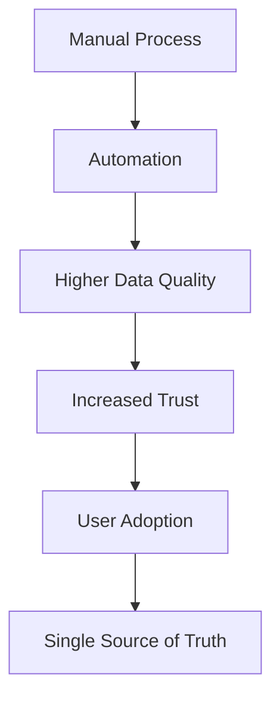
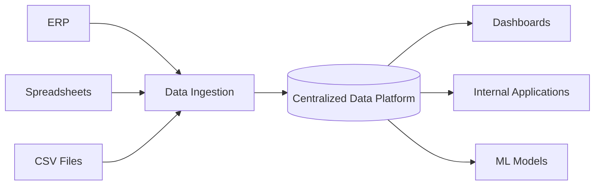
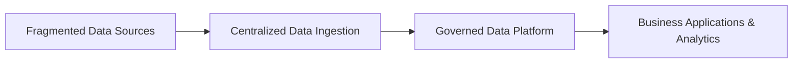

# Building a Single Source of Truth

## Executive Summary

As organizations grow, data naturally becomes fragmented.

Enterprise systems coexist with spreadsheets, manually maintained reports, and department-specific databases. Over time, each team develops its own processes, metrics, and definitions, often resulting in multiple versions of the same business information.

This fragmentation slows decision-making, reduces trust in data, and increases the operational effort required to maintain reporting processes.

This case study presents an engineering approach to transforming fragmented operational data into a centralized and trusted data platform.

Rather than focusing on implementation details or proprietary systems, the objective is to describe the engineering principles, architectural decisions, and lessons learned while designing a platform intended to become the organization's Single Source of Truth.

---

# The Problem

Most organizations do not suffer from a lack of data.

They suffer from a lack of trusted data.

Different departments frequently consume information from different sources:

- ERP systems
- Spreadsheets maintained by individual teams
- Manual reports
- Department-specific databases
- Ad-hoc exports

Although every dataset may be technically correct, they often represent different moments in time, different business rules, or different transformation logic.

As a consequence:

- reports provide conflicting numbers
- teams spend significant time validating information instead of using it
- business decisions become dependent on who generated the report
- automation becomes increasingly difficult
- new software projects inherit inconsistent data from the beginning

The objective was not simply to centralize data.

The real challenge was to build a platform that people could trust enough to stop maintaining their own versions of the truth.

---

# Why This Problem Exists

Data fragmentation is rarely caused by poor technology.

More often, it is the natural consequence of organizational growth.

As new business needs emerge, teams build local solutions to solve immediate problems:

- spreadsheets become operational systems
- manual processes evolve into business-critical workflows
- reporting logic is duplicated across departments
- data ownership becomes unclear

Over time, these independent solutions create a complex ecosystem where multiple versions of the same information coexist.

The technical challenge is therefore only one part of the problem.

The organizational challenge is enabling different teams to converge toward a common source of trusted information.

---

# Design Principles

Before selecting technologies or defining the architecture, a set of engineering principles guided every design decision.

## 1. One Trusted Source

Business information should originate from a single governed source.

Every report, dashboard, automation, or internal application should consume data from the same platform rather than maintaining independent datasets.

---

## 2. Automate Data Collection

Whenever possible, manual data entry should be replaced by automated ingestion processes.

Reducing manual intervention improves data quality while allowing business users to focus on operational tasks instead of administrative work.

---

## 3. Governance Before Analytics

Analytics only become valuable when everyone agrees on the meaning of the underlying data.

Business definitions, ownership, and validation rules should therefore be established before building reports or machine learning models.

---

## 4. Build Once, Reuse Everywhere

Business logic should exist only once.

Transformations should be centralized so that every downstream consumer works with the same validated information.

---

## 5. Reduce Operational Friction

Technology should simplify existing workflows.

The easier a new system is to use, the faster it becomes part of the organization's daily operations.

---

## Adoption Strategy

The technical platform was introduced together with operational improvements.

Rather than forcing organizational change, adoption was driven by replacing repetitive manual tasks with standardized workflows.

---

# High-Level Architecture

The solution follows a centralized data platform architecture where operational systems act as data producers while downstream applications consume standardized and governed datasets.

The architecture separates operational systems from analytical consumers.

Instead of allowing each department to maintain its own transformation logic, every downstream system consumes standardized datasets generated from a common platform.

This approach improves consistency, reduces maintenance effort, and creates a scalable foundation for future data products.

---

# Migration Strategy

Instead of replacing every operational process simultaneously, the platform evolved through incremental improvements.

Each delivery solved an existing business problem while reinforcing the long-term architecture.

The migration followed four stages.

Each stage generated immediate business value while reducing technical debt and increasing organizational adoption.

---

# Implementation Strategy

Building a Single Source of Truth was not approached as a single migration project.

Instead, the strategy focused on gradually replacing fragmented processes while continuously increasing the value delivered to business users.

Rather than forcing every department to adopt a completely new workflow, each implementation solved an existing operational problem while contributing to a broader architectural vision.

This incremental approach reduced resistance to change and allowed the platform to grow organically.

The implementation strategy was based on four major pillars.

## 1. Centralize Data

The first objective was to eliminate isolated datasets spread across operational systems, spreadsheets and manually maintained reports.

Data ingestion pipelines consolidated information into a centralized platform where business entities could be modeled consistently.

Instead of asking which spreadsheet contained the correct information, every process started from the same governed datasets.

---

## 2. Standardize Business Logic

Different departments frequently calculated the same business metrics using different transformation rules.

Business logic was progressively centralized so that calculations were implemented once and reused everywhere.

This reduced inconsistencies between reports while significantly lowering long-term maintenance effort.

---

## 3. Automate Operational Processes

Automation was never considered the final objective.

Instead, it became the mechanism for improving data quality while reducing repetitive manual work.

Each automated workflow not only removed operational effort, but also generated cleaner and more reliable information for the centralized platform.

As adoption increased, data quality improved naturally because users interacted directly with standardized processes rather than maintaining independent records.

---

## 4. Enable Future Systems

The platform was designed as an engineering foundation rather than a reporting solution.

Once trusted datasets became available, new internal applications, dashboards and analytical models could be developed without rebuilding data pipelines for every project.

This significantly reduced the complexity of future software initiatives while allowing different systems to share the same business definitions.

---

# Technology Decisions

Technology selection followed architectural requirements rather than driving them.

The objective was to prioritize scalability, maintainability and simplicity over adopting technologies solely because they were popular.

The platform was intentionally built using a modular architecture where each component had a clearly defined responsibility.

## Cloud Infrastructure

Google Cloud Platform (GCP) was selected as the primary cloud provider to support scalable deployments, managed services and centralized infrastructure.

---

## Backend

The backend was implemented in Python following an API-first architecture responsible for:

- business logic
- authentication and authorization
- workflow orchestration
- scheduled processes
- data access

---

## Frontend

A modern web interface was developed to provide a consistent user experience across operational areas while reducing dependence on spreadsheets and manual processes.

---

## Database

A centralized relational database became the operational foundation of the platform.

Application data, workflows and business entities were modeled around shared definitions instead of department-specific structures.

---

## CI/CD

Deployment pipelines were fully automated using GitHub Actions.

Separate deployment workflows supported development and production environments, allowing new features to be validated before production releases.

---

# Results

The objective of the initiative extended beyond centralizing data.

The primary outcome was establishing a trusted foundation capable of supporting future operational and analytical systems.

The resulting platform enabled:

- a centralized source of business information
- standardized business definitions across departments
- reusable data pipelines
- reduced dependence on manually maintained spreadsheets
- improved data accessibility
- faster development of internal applications
- a scalable foundation for future machine learning initiatives

Although technology played a fundamental role, the greatest impact came from reducing organizational friction around data consumption.

Teams gradually shifted from maintaining independent datasets to consuming shared, governed information.

---

# Lessons Learned

## 1. Technology Is Rarely the Hardest Problem

Building pipelines, databases and applications is usually the simplest part of a data transformation initiative.

Building trust is significantly harder.

Without confidence in the underlying data, even technically excellent platforms struggle to gain adoption.

---

## 2. User Adoption Starts With Solving Daily Problems

People rarely adopt a new platform because it is technically superior.

They adopt it because it makes their work easier.

Automating repetitive tasks, reducing manual reporting effort and simplifying operational workflows proved to be stronger adoption drivers than technical improvements alone.

---

## 3. Data Governance Should Not Be an Afterthought

Governance is often introduced after reports and dashboards have already been built.

In practice, defining ownership, business rules and common terminology early reduces technical debt and prevents duplicated business logic from spreading across the organization.

---

## 4. Every Automation Is Also a Data Product

Every automated workflow generates structured information.

When designed correctly, operational automations become reliable producers of high-quality business data rather than isolated productivity tools.

---

## 5. Platforms Should Enable Future Development

The greatest value of a centralized platform is not the reports it produces today.

Its long-term value lies in enabling future applications, analytical models and automation initiatives without rebuilding the data foundation.

---

# What I Would Do Differently Today

Looking back, several aspects of the implementation could be improved.

## Introduce Data Contracts Earlier

Clearly defining ownership, schemas and validation rules at the beginning of the project would reduce downstream maintenance and simplify onboarding for future systems.

---

## Measure Adoption Explicitly

Technical metrics alone do not reflect the success of a data platform.

Tracking user adoption, process replacement and operational improvements would provide a more complete view of platform maturity.

---

## Invest Earlier in Documentation

Architecture documentation, operational playbooks and engineering standards become increasingly valuable as platforms grow.

Producing them earlier would accelerate onboarding and reduce knowledge concentration.

---

## Design for AI From Day One

Modern enterprise platforms should not only support reporting and analytics.

They should expose well-governed, structured data that can safely power AI assistants, intelligent workflows and future machine learning applications.
