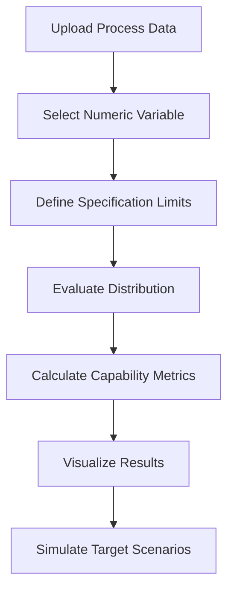

# Process Capability Analysis Tool

## Executive Summary

During my time at Olympus EMEA, a production team needed a practical way to perform process capability analysis without relying on expensive enterprise statistical software licenses.

The existing reference tool was Minitab, which provided the required statistical functionality but represented a costly option for broader internal usage.

Based on the team's analytical needs, I developed a lightweight internal application that reproduced the required workflow in a focused and accessible way.

The tool was designed to help users upload process data, select numerical variables, evaluate normality, calculate process capability metrics, and simulate target scenarios using Monte Carlo methods.

Rather than replacing a full commercial statistical suite, the objective was to solve a specific operational problem with a simpler, cheaper and more focused internal tool.

---

# Context

Before this project, I had already developed several automation tools at Olympus EMEA.

These tools were created to extract, transform and structure operational data that was previously handled manually. This work helped build internal trust in my ability to identify repetitive processes and convert them into practical software solutions.

That trust eventually led to a request from a production team in France.

The team needed to perform process capability analysis, but the available commercial solution was expensive at enterprise scale.

The challenge was to determine whether a focused internal tool could cover the required workflow without introducing unnecessary complexity.

---

# The Problem

Process capability analysis is useful for understanding whether a process can consistently produce results within specification limits.

However, in practice, this type of analysis often depends on specialized statistical software.

For the production team, the main challenges were:

- high cost of commercial software licenses
- limited access for broader internal usage
- dependency on specific tools and users
- repetitive analytical workflows
- need for a simpler interface focused on the actual use case

The objective was not to replicate every feature of a professional statistical suite.

The objective was to build a practical tool that covered the specific analysis workflow required by the team.

---

# Engineering Challenge

The main challenge was not only statistical.

The tool needed to translate a specialized analytical workflow into a simple interface that production users could understand and apply consistently.

This required balancing three constraints:

- statistical correctness
- usability for non-programmers
- cost reduction compared to commercial software

The solution had to be narrow enough to remain maintainable, but complete enough to support real process analysis decisions.

---

# Build vs Buy Decision

The reference tool for the required workflow was Minitab.

Minitab provided the statistical functionality needed by the team, but the enterprise licensing cost made it difficult to justify for a narrow operational use case.

The decision to build an internal alternative was based on several considerations.

## Design Principles

The internal tool was guided by a few practical design principles.

### 1. Solve the Specific Workflow

The objective was not to recreate an entire statistical software package.

The tool focused only on the process capability workflow required by the production team.

### 2. Keep the Interface Simple

Users needed to move from data input to analytical result without interacting directly with Python code.

The interface was therefore designed around the sequence of decisions users needed to make.

### 3. Make the Analysis Repeatable

A standardized workflow reduced variation in how analyses were performed and made results easier to compare.

### 4. Avoid Overengineering

The tool was intentionally lightweight.

A simple application was more appropriate than a complex architecture for this use case.

---

## Buy

A commercial tool offered:

- mature statistical functionality
- professional user interface
- broad analytical coverage
- established reliability

However, it also introduced:

- high licensing costs
- limited accessibility
- unnecessary functionality for the specific use case
- dependency on a third-party software package

---

## Build

An internal tool offered:

- lower cost
- focused functionality
- easier access for internal users
- workflow customization
- control over calculations and outputs

The trade-off was that the internal tool needed to remain intentionally limited.

It was not designed to replace a complete statistical software suite.

It was designed to solve one clearly defined operational problem.

---

# Application Workflow

The application followed a simple analytical workflow.

The workflow was designed to be understandable for users who needed reliable analytical results without interacting directly with Python code or statistical libraries.

---

# Technology Stack

The tool was implemented as a lightweight Python application using Streamlit.

The architecture prioritized simplicity and fast delivery over unnecessary system complexity.

Core components included:

- **Streamlit** for the user interface
- **Pandas** for tabular data handling
- **NumPy** for numerical operations
- **SciPy** for statistical calculations
- **Matplotlib / Plotly** for visualizations
- **CSV / Excel inputs** for process data loading

Instead of building a complex multi-service system, the application was designed as a focused analytical interface around a specific statistical workflow.

---

# Statistical Capabilities

The tool supported the key steps required for process capability analysis.

These included:

- loading structured process data
- selecting numerical variables
- defining specification limits
- evaluating distribution behavior
- calculating process capability indicators
- visualizing process performance
- simulating target scenarios through Monte Carlo methods

The analytical goal was to support practical engineering decisions rather than provide a general-purpose statistics environment.

---

# Key Engineering Decision

The most important engineering decision was to limit the scope of the application.

A broader tool would have been harder to validate, maintain and explain.

By focusing on one specific workflow, the application could deliver value quickly while avoiding unnecessary complexity.

This made the internal solution easier to justify as an alternative to expensive commercial software for the specific operational need.

---

# Results

The project demonstrated that a focused internal tool could address a recurring operational need without requiring a full commercial software dependency.

The resulting application helped:

- reduce reliance on expensive statistical software licenses
- make process capability analysis more accessible
- standardize a recurring analytical workflow
- support production teams with a practical internal solution
- demonstrate how automation and lightweight software can solve real operational problems

The broader value was not only the application itself, but the engineering judgment behind it: identifying when a smaller internal solution is more appropriate than purchasing a large commercial tool.

---

# Lessons Learned

## 1. Build vs Buy Is Context-Dependent

Commercial software is often the right choice when broad functionality, vendor support and long-term maintenance are required.

However, when the use case is narrow, repetitive and well understood, a focused internal tool can provide significant value at lower cost.

---

## 2. Simplicity Can Be a Technical Advantage

The objective was not to build the most complete statistical tool possible.

The objective was to build the simplest tool that solved the actual problem.

This reduced complexity and made the application easier to understand, use and maintain.

---

## 3. User Workflows Matter as Much as Calculations

Correct statistical calculations are essential, but they are not enough.

Users also need a clear workflow that guides them from raw data to actionable results.

The interface was therefore designed around the analysis process rather than around the underlying code structure.

---

## 4. Internal Tools Can Create Strategic Value

Small internal applications can generate significant business value when they replace repetitive manual work or reduce dependency on expensive external tools.

The impact comes from solving the right problem with the right level of complexity.

---

# What I Would Do Differently Today

Looking back, several aspects of the tool could be improved.

## Add Automated Tests for Statistical Calculations

Capability metrics should be validated through automated tests using known reference datasets.

This would increase confidence in the correctness of the results and simplify future maintenance.

---

## Improve Documentation Around Statistical Assumptions

Process capability analysis depends on assumptions about data distribution, stability and measurement quality.

Documenting these assumptions more explicitly would help users interpret results more responsibly.

---

## Separate Calculation Logic From the User Interface

The application logic could be modularized further by separating statistical calculations from the Streamlit interface.

This would make the tool easier to test, reuse and extend.

---

## Add Exportable Reports

Generating standardized PDF or HTML reports would make it easier for teams to share results and document decisions.