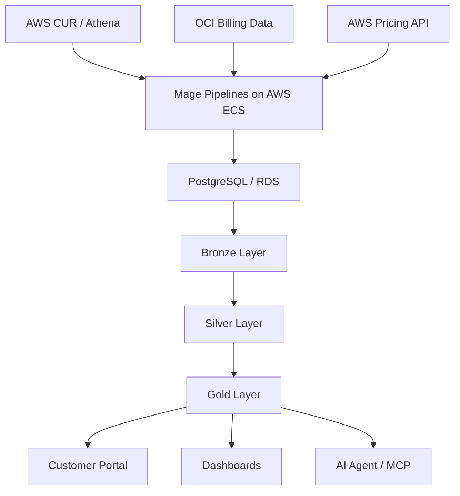
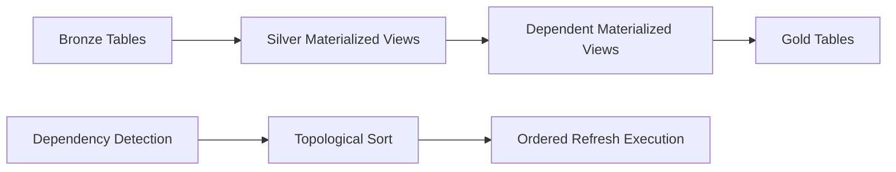

# FinOps Data Platform

## Executive Summary

This case study documents the design of a multi-cloud FinOps data platform built to centralize, standardize and expose cloud cost data across providers.

The platform ingested billing and pricing data from AWS and OCI, processed it through Mage pipelines running on AWS ECS, and consolidated the results into a PostgreSQL/RDS database structured around a medallion-style architecture.

Raw cloud billing exports were loaded into bronze tables, transformed and standardized through silver materialized views, and refined into gold analytical datasets consumed by the customer portal and AI-enabled workflows.

The platform was designed to support FOCUS-aligned financial analytics, improve cloud cost visibility, and create a reliable data foundation for dashboards, automation and AI agents.

---

# Context

Cloud cost data is complex by nature.

Different providers expose billing information in different formats, with different levels of granularity, terminology and pricing structures.

In a FinOps context, this creates a recurring engineering challenge: raw billing exports are valuable, but they are rarely ready for direct business consumption.

The objective of this project was to design a data platform capable of ingesting multi-cloud cost data, standardizing it, and exposing reliable analytical outputs for downstream systems.

The platform was built around three major needs:

- consolidating cloud billing data from multiple providers
- organizing transformations through a medallion-style data model
- exposing curated datasets for a customer portal and AI-enabled workflows

---

# The Problem

Cloud financial data is difficult to use directly.

Raw billing exports are often large, provider-specific and optimized for completeness rather than usability.

For FinOps analytics, the main challenges were:

- different billing structures across cloud providers
- high-volume AWS CUR data
- provider-specific pricing APIs
- inconsistent levels of detail across sources
- need for repeatable transformations
- dependency management between analytical views
- reliable downstream consumption by applications and AI workflows

The objective was not only to load cloud cost data into a database.

The objective was to create a trusted FinOps data foundation that could support analytics, automation and product-facing use cases.

---

# Platform Architecture

The platform followed a cloud-native ETL architecture.

Mage was used to orchestrate data pipelines running on AWS ECS, while PostgreSQL/RDS acted as the centralized analytical database.

This architecture separated ingestion, transformation and consumption responsibilities.

Instead of allowing downstream systems to consume raw provider data directly, the platform exposed standardized datasets through curated database layers.

---

# Medallion Data Architecture

The database was organized using a medallion-style architecture.

This structure separated raw ingestion, standardized transformations and business-ready analytical outputs.

## Bronze Layer

The bronze layer stored raw or lightly processed billing data extracted from cloud providers.

Depending on the source and table type, AWS CUR and OCI billing data were loaded into provider-specific bronze tables.

The objective of this layer was to preserve source-level detail while creating a consistent ingestion foundation.

---

## Silver Layer

The silver layer was implemented mainly through materialized views.

These views standardized, enriched and reshaped bronze data into reusable analytical structures.

Because several views depended on other views, refresh order became an important engineering problem.

To solve this, materialized views were refreshed in dependency order using a topological sort.

---

## Gold Layer

The gold layer contained curated datasets designed for business consumption.

These tables supported the customer portal, reporting use cases and AI-enabled workflows.

The purpose of the gold layer was to expose reliable, business-ready data without forcing downstream systems to understand raw billing structures.

---

# Multi-Cloud ETL Framework

The ETL framework was designed to support different cloud providers and extraction patterns through configurable profiles.

Each profile defined how the pipeline should behave depending on the provider, billing structure, date filtering requirements and company identifier logic.

The framework supported patterns such as:

- AWS extraction with CID iteration
- AWS extraction without CID iteration
- AWS extraction with date filtering
- AWS extraction without date filtering
- OCI extraction with date filtering
- OCI extraction without date filtering

This avoided hardcoding one pipeline per provider or use case.

Instead, the pipeline could adapt its extraction and loading behavior based on configuration.

Core capabilities included:

- extraction from Athena
- chunk-based processing
- data validation before loading
- dynamic partition creation
- PostgreSQL/RDS loading
- metadata validation
- Slack alerts for parameter overrides
- support for `COPY` and bulk insertion strategies

---

# Materialized View Refresh Strategy

The analytical layer relied on materialized views to transform raw and intermediate data into reusable structures.

However, materialized views often depended on other materialized views or database functions.

Refreshing them in the wrong order could lead to incomplete or inconsistent downstream data.

To solve this, the refresh process detected dependencies between database objects and calculated the correct execution order using a topological sort.

This ensured that downstream views were refreshed only after their upstream dependencies had been updated.

---

# AWS Pricing Integration

The platform also included utilities for extracting AWS pricing information.

This was important because FinOps analytics often require more than usage and cost data.

Reliable pricing context is needed to support comparisons, optimization opportunities and financial interpretation.

The AWS pricing integration handled:

- AWS role assumption
- token refresh
- AWS Pricing API access
- Savings Plans pricing data
- region mapping
- paginated extraction
- PostgreSQL loading

This allowed the platform to combine billing data with pricing reference data for richer financial analysis.

---

# FOCUS Alignment

The platform was designed with FOCUS-aligned analytics in mind.

FOCUS provided a common conceptual model for standardizing cloud cost and usage information across providers.

The platform used this direction to transform provider-specific billing data into more consistent analytical structures.

The goal was not simply to store cloud invoices.

The goal was to create a normalized FinOps data layer that could support cross-provider analysis, business reporting and future automation.

---

# Results

The platform created a centralized foundation for multi-cloud FinOps analytics.

It helped:

- consolidate AWS and OCI cost data into a single analytical database
- structure cloud financial data using bronze, silver and gold layers
- standardize provider-specific billing information
- refresh analytical views in dependency order
- support customer-facing portal data
- provide curated data for AI-enabled workflows
- reduce duplicated transformation logic across downstream consumers

The broader value was the creation of a reusable data foundation for cloud financial intelligence.

---

# Lessons Learned

## 1. FinOps Data Requires More Than Ingestion

Loading cloud billing data is only the first step.

The real value comes from transforming raw provider data into trusted analytical structures that business users and applications can consume.

---

## 2. Medallion Architecture Fits FinOps Workloads Well

Separating raw, standardized and business-ready data made the platform easier to reason about.

It also reduced the risk of downstream systems depending directly on raw provider formats.

---

## 3. Dependency Management Matters

Materialized views are useful for analytical performance, but they introduce refresh-order complexity.

A dependency-aware refresh strategy was necessary to keep the analytical layer consistent.

---

## 4. Configuration Prevents Pipeline Duplication

A profile-based ETL framework made it possible to support multiple providers and extraction patterns without duplicating pipeline logic.

This improved maintainability and reduced operational complexity.

---

## 5. AI Workflows Depend on Data Foundations

AI agents and MCP-based workflows are only useful when they can access reliable, well-structured data.

The gold layer became important not only for dashboards and portals, but also for AI-enabled data access.

---

# What I Would Do Differently Today

Looking back, several aspects of the platform could be improved.

## Formalize Data Contracts Earlier

Clear data contracts between bronze, silver and gold layers would make the platform easier to evolve and validate.

---

## Add Automated Data Quality Checks

Automated checks for row counts, null rates, duplicate records and cost reconciliation would improve confidence in every pipeline run.

---

## Create More Explicit Lineage Documentation

Documenting how each gold table was derived from upstream bronze and silver objects would simplify onboarding and troubleshooting.

---

## Separate Provider Logic More Clearly

Provider-specific extraction logic could be further isolated behind clearer interfaces, making it easier to add new providers over time.

---

## Improve Observability

More structured logging, pipeline-level metrics and failure dashboards would make the platform easier to operate at scale.
