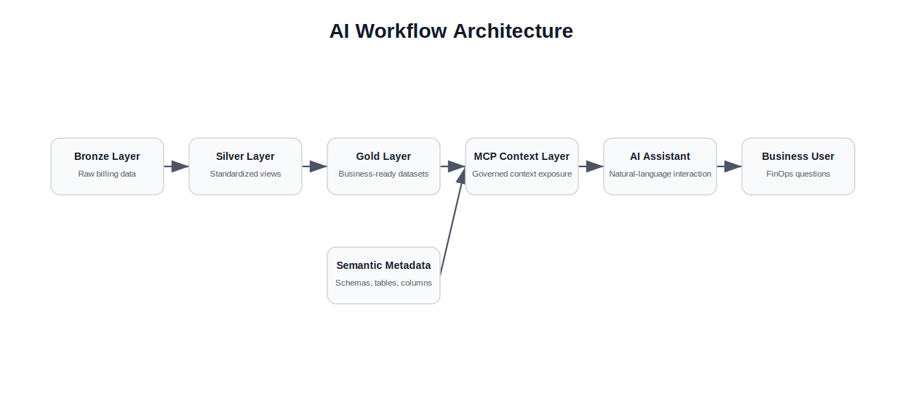
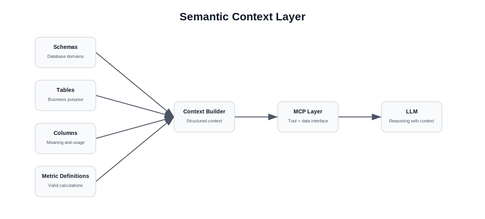
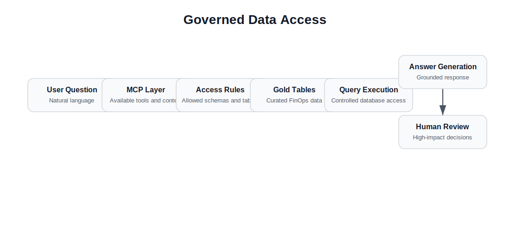
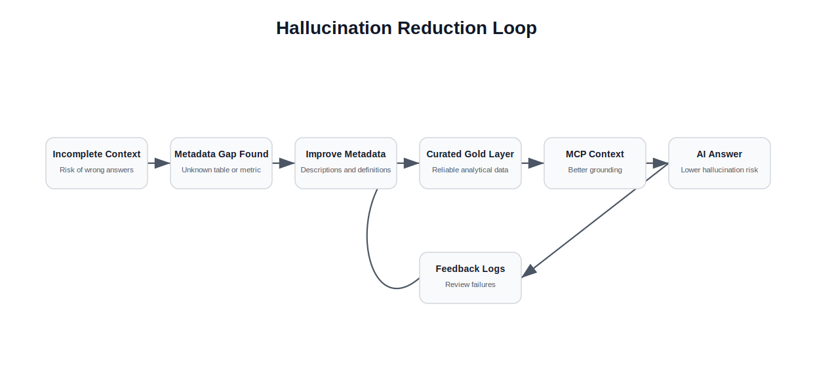

# Enterprise AI Workflows on Governed Data

## Executive Summary

This case study documents the design of an AI-enabled workflow built on top of governed FinOps data.

The objective was not simply to connect a language model to a database.

The real challenge was enabling an AI assistant to answer business questions reliably by giving it access to trusted data, curated analytical tables and structured metadata about schemas, tables and columns.

The project demonstrated an important principle: model quality alone is not enough.

Even a strong language model produces poor answers when the underlying data is incomplete, poorly modeled or missing context.

To reduce hallucinations and avoid invented metrics, the workflow relied on curated gold datasets, semantic table descriptions and column-level metadata that helped the MCP layer understand what each table represented and when it should be used.

---

# Context

The AI workflow was built as an extension of a FinOps data platform.

That platform already consolidated cloud cost and pricing data into a PostgreSQL/RDS database using a medallion-style architecture.

Raw billing data was loaded into bronze tables, transformed through silver materialized views and refined into gold analytical datasets.

These gold tables were designed for business consumption by the customer portal, dashboards and AI-enabled workflows.

The AI/MCP layer depended on that governed data foundation.

Without reliable data and clear metadata, the assistant could not safely answer questions about cloud costs, usage or optimization opportunities.

---

# The Problem

Large language models are powerful, but they do not automatically understand enterprise data.

When connected to a database without enough context, a model may:

- select the wrong table
- misunderstand column meanings
- invent unavailable metrics
- aggregate data incorrectly
- confuse similar financial concepts
- generate confident but incorrect answers

In a FinOps context, this risk is especially important.

Cloud financial data contains provider-specific terminology, billing periods, pricing concepts, discounts, commitments and usage dimensions.

The objective was to design an AI workflow that could use enterprise data safely by grounding the model in curated datasets and structured metadata.

---

# Why Data Context Matters

A key lesson from the project was that AI performance depends heavily on the quality of the input context.

A better model does not solve poor data modeling.

If the model receives unclear schemas, undocumented columns or raw billing tables without business meaning, it may produce unreliable answers.

The workflow therefore needed more than database access.

It needed a semantic context layer.

This context layer described:

- which schemas existed
- what each table represented
- what each column meant
- which tables were business-ready
- which tables should be used for specific analytical questions
- which metrics were valid and which were not available

This helped the assistant reason over governed data instead of guessing from raw database structures.

---

# Architecture

The AI workflow was designed around governed access to curated data.

  

The gold layer provided reliable analytical data.

The metadata layer provided semantic meaning.

The MCP layer combined both to expose a safer context to the AI assistant.

---

# Semantic Metadata Layer

The semantic metadata layer was one of the most important parts of the workflow.

  

Each relevant table was enriched with descriptions about:

- schema purpose
- table purpose
- column meaning
- expected usage
- analytical relevance

This metadata allowed the MCP layer to provide the model with context before it generated an answer.

Instead of asking the model to infer meaning from column names alone, the system provided explicit descriptions of what the data represented.

This reduced the risk of hallucinated metrics and improved the likelihood that the assistant selected the right data source.

---

# Gold Layer as AI-Ready Data

The AI assistant was not intended to reason directly from raw billing exports.

Raw cloud billing data is too detailed, provider-specific and difficult to interpret without transformation.

Instead, the assistant relied on gold datasets.

These datasets were already cleaned, standardized and structured for business consumption.

This made them suitable for:

- cost analysis
- usage summaries
- optimization questions
- customer-facing insights
- AI-assisted explanations
- controlled analytical workflows

The gold layer acted as the trusted interface between complex FinOps data and natural-language interaction.

---

# Governed Data Access

The workflow separated natural-language interaction from direct database access.

The assistant did not operate as an unrestricted database client.

Instead, the MCP layer exposed curated data and metadata through a controlled context interface.

  

This design helped ensure that the model reasoned over approved data structures rather than raw or ambiguous sources.

---

# MCP Design Principles

The MCP workflow was guided by several design principles.

## 1. Ground the Model in Curated Data

The assistant should use business-ready datasets instead of raw provider exports whenever possible.

This reduced complexity and improved answer reliability.

---

## 2. Provide Context Before Asking for Reasoning

The model needed structured descriptions of schemas, tables and columns before deciding how to answer a question.

Context was treated as part of the system design, not as an afterthought.

---

## 3. Avoid Invented Metrics

The assistant should not create metrics that were not available in the data model.

If a metric did not exist, the correct behavior was to explain the limitation rather than fabricate an answer.

---

## 4. Separate Data Access From Interpretation

The MCP layer was responsible for exposing available data and metadata.

The model was responsible for interpreting that context and generating a useful response.

This separation made the workflow easier to reason about and improve.

---

## 5. Prefer Governed Tables Over Raw Sources

Raw data remained available for traceability, but analytical workflows were expected to rely on curated gold tables.

This reduced the risk of inconsistent calculations.

---

# Key Engineering Decisions

## 1. Use Metadata as Context

Schema, table and column descriptions were stored as part of the data platform and exposed to the MCP layer.

This gave the model a structured understanding of the database.

---

## 2. Build on the Gold Layer

The AI workflow was built on top of curated FinOps tables rather than raw billing exports.

This improved consistency and reduced the amount of interpretation required from the model.

---

## 3. Treat Hallucination as a Data Problem

Hallucination was not treated only as a model limitation.

It was also treated as a data-quality, metadata and context-design problem.

Better context reduced the probability that the model would invent metrics or misuse tables.

---

## 4. Keep Business Logic in the Data Platform

Business definitions and analytical logic were kept in the data platform instead of being recreated inside prompts.

This made the workflow more maintainable and reduced inconsistencies.

---

# Results

The workflow demonstrated that enterprise AI systems depend on governed data foundations.

The project helped show that an AI assistant can become more reliable when it is supported by:

- curated gold datasets
- clear schema descriptions
- table-level metadata
- column-level metadata
- controlled data access
- explicit metric definitions
- separation between raw data and business-ready data

The broader value was the connection between data engineering and AI enablement.

The AI assistant was only useful because the underlying data platform made the right information available in a structured and explainable way.

---

# Hallucination Reduction Loop

The team learned that hallucination was not only a model behavior problem.

It was also a context-design problem.

When the assistant produced weak or ambiguous answers, the fix was often to improve the data model, table descriptions, column descriptions or available context.

  

This created a feedback loop between AI behavior and data platform quality.

---

# Lessons Learned

## 1. AI Quality Depends on Data Quality

The quality of the model matters, but the quality of the data and context often matters more.

A strong model with poor input produces poor output.

---

## 2. Metadata Is Part of the Product

Descriptions of schemas, tables and columns are not just documentation.

In AI workflows, metadata becomes operational context that directly affects model behavior.

---

## 3. Gold Tables Are Better Interfaces for AI

Business-ready datasets are safer and easier for AI systems to use than raw transactional or billing data.

The gold layer acts as a stable interface between complex data platforms and natural-language workflows.

---

## 4. Hallucination Can Be Reduced Through Context Design

Models hallucinate more easily when they are forced to infer business meaning from incomplete context.

Providing structured metadata reduces ambiguity and improves answer reliability.

---

## 5. Enterprise AI Requires Governance

AI workflows should not bypass governance.

They should build on top of governed data models, controlled access patterns and clear business definitions.

---

# What I Would Do Differently Today

Looking back, several aspects of the workflow could be improved.

## Add Stronger Query Guardrails

The assistant should have explicit limits around which tables it can query and which operations it can perform.

---

## Create a Formal Semantic Catalog

Schema, table and column descriptions could be organized into a more formal semantic catalog.

This would make the context layer easier to maintain and extend.

---

## Add Answer Validation

Generated answers could be validated against known metrics, row counts or reconciliation checks before being returned to the user.

---

## Track Model Failures

Incorrect answers, missing context and failed queries should be logged and reviewed.

This would allow the metadata layer to improve over time.

---

## Improve Human-in-the-Loop Review

For high-impact financial decisions, AI-generated insights should be reviewed by a human before action is taken.
