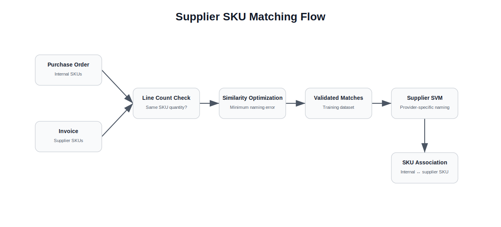
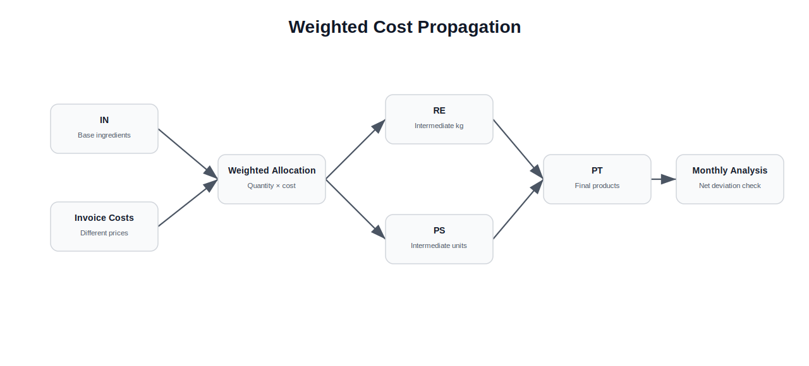
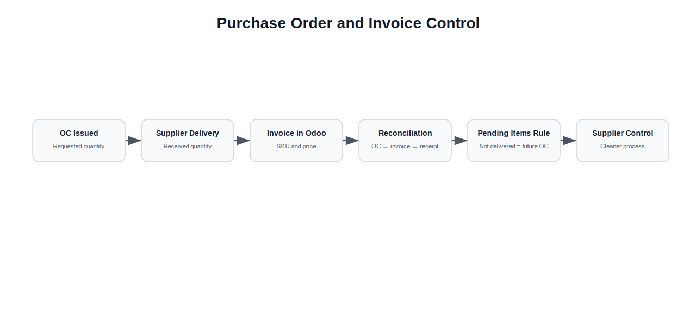
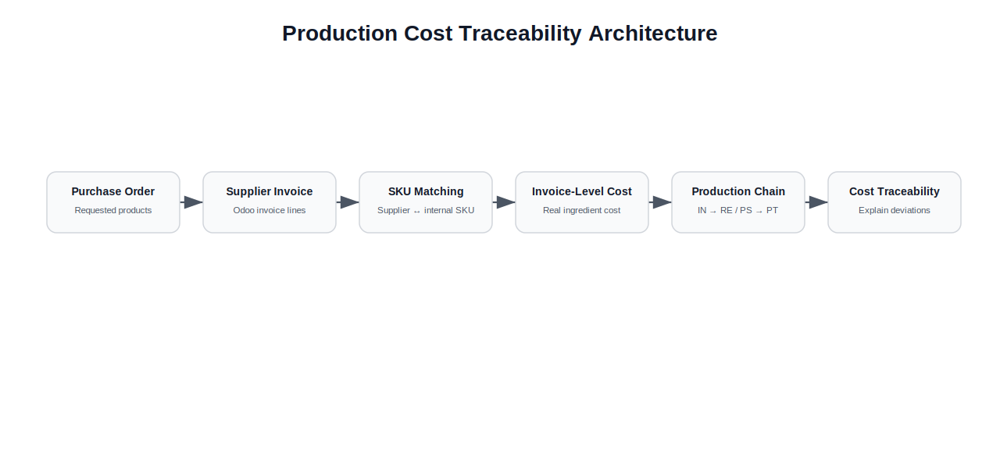

# Production Cost Traceability


## Executive Summary

This case study documents the design of an operational cost traceability system built to understand how real supplier invoice costs flowed through a food production chain.

The company had recurring cost deviations during monthly inventory closing.

These deviations were often grouped under generic production cost categories because it was unclear whether the problem came from physical quantities, incorrect inventory counts or incorrect product costs.

The hypothesis was that the main issue was not quantity.

It was price.

The company had the data required to investigate the problem, but the data could not communicate across systems.

Internal SKUs, supplier SKUs, purchase orders, invoices, intermediate products and final products were not connected in a way that made cost traceability reliable.

The solution combined supplier SKU matching, invoice-level cost reconciliation, provider-specific classification logic and a weighted cost propagation model to trace ingredient costs through the full production chain.

---

# Context

Fork operated with a production structure where products moved through several levels before becoming final customer-facing items.

The main product categories were:

- **IN**: base ingredients purchased from suppliers
- **RE**: intermediate production measured in kilograms
- **PS**: intermediate production measured in units
- **PT**: final products or plated items

The cost of a final product depended on the cost of its ingredients, the intermediate production steps and the way batches were mixed throughout the production process.

This made cost allocation difficult.

A final product could contain ingredients purchased at different prices across different invoices and dates.

Intermediate products could also mix different ingredient batches, creating different effective costs for similar production outputs.

---

# The Problem

Every month, the company performed inventory counts and reviewed cost deviations.

These deviations could become significant, but they were difficult to explain.

The organization could not always determine whether the deviation came from:

- incorrect counted quantities
- incorrect received quantities
- incorrect product costs
- supplier price differences
- unmatched purchase orders
- invoice inconsistencies
- production batch cost propagation

A major issue was that internal SKUs and supplier SKUs did not have a direct relationship.

The same product could be named differently by each supplier.

This made it difficult to compare:

- what was agreed in the purchase order
- what was actually invoiced
- what price was charged
- which internal ingredient the invoice line referred to
- how that cost should flow into production

The company had data, but the data was not usable without a translation layer.

---

# Core Hypothesis

The working hypothesis was:

> The main deviation was caused by **P**, not **Q**.

In other words, the problem was more likely related to price than to quantity.

The goal was therefore to build a system that could connect supplier invoice prices to internal product structures and trace those costs downstream into production.

---

# Solution Overview

The solution had two main fronts.

## 1. Supplier SKU Matching

The first problem was to connect supplier SKUs with internal SKUs.

This was required to understand which supplier invoice line corresponded to which internal ingredient.

The system used two matching strategies.

<p align="center">
  
</p>

### Similarity-Based Optimization

When a purchase order and its related invoice had the same number of SKU lines, the system attempted to find the best internal SKU to supplier SKU mapping.

It compared words between the internal product names and supplier product names.

The selected mapping was the combination that minimized the total naming error across the order.

This approach was applied only when the input conditions were controlled enough to reduce the risk of incorrect matching.

If the number of ordered SKUs and invoiced SKUs did not match, the model did not apply automatic matching.

This was an intentional engineering decision.

The system preferred not to produce a result rather than produce an unreliable one.

### Provider-Specific SVM Classification

Once enough validated SKU associations existed, the system used them as training data.

The SVM model learned, by supplier, how a product was typically named and how it was not typically named.

This allowed the system to suggest likely supplier SKU matches for internal SKUs based on historical naming patterns.

The SVM was not the full solution.

It was one component inside a broader reconciliation and traceability system.

---

## 2. Cost Propagation Through Production

After supplier invoice costs were assigned to internal ingredients, the second problem was to propagate those costs through the production chain.

The chain followed this structure:

```text
IN -> RE / PS -> PT
```

<p align="center">
  
</p>

Where:

- ingredients entered as **IN**
- intermediate production became **RE** or **PS**
- final products became **PT**

The difficult part was that intermediate batches could mix ingredients purchased at different prices.

This meant that two batches of the same intermediate product could have different effective costs.

To address this, a weighted allocation method was designed.

The approach used the produced quantity of each batch and the invoice-level cost of the ingredients involved to calculate a weighted cost for each intermediate product.

The idea was inspired by the concept of a center of mass from mechanical engineering.

Instead of treating all input costs as equal, the model weighted costs according to the quantity and value composition of the production batch.

At the batch level, small deviations could still appear.

But when the analysis was aggregated over a full month, the effects largely netted out, leaving only minor decimal accumulation differences.

---

# Purchase Order and Supplier Delivery Control

The model also exposed an operational problem in the purchasing and receiving process.

Supplier deliveries were not always aligned with the original purchase orders.

Suppliers could deliver partial quantities, leave products pending and then bring the missing items weeks later.

By that time, the missing items were often no longer useful for the original production need.

There was also no reliable link between:

```text
purchase order issued
|
products actually received
|
invoice entered into Odoo
|
supplier SKU and price
|
internal SKU and cost
```

<p align="center">
  
</p>

By connecting purchase orders, invoice-level supplier SKUs, received quantities and internal products, the system made it possible to establish clearer internal rules for supplier deliveries.

One important operational guideline was:

> If an item was not delivered as part of the agreed purchase order, it was treated as not delivered and had to be included in a future purchase order instead of remaining indefinitely pending.

This improved purchasing discipline and made supplier behavior easier to control.

The system therefore did more than calculate costs.

It helped establish better operating rules between purchasing, receiving, suppliers and accounting.

---

# Architecture

<p align="center">
  
</p>

---

# Key Engineering Decisions

## 1. Avoid Automatic Matching When the Input Was Ambiguous

The similarity-based optimization was applied only when the purchase order and invoice had the same number of SKU lines.

If the inputs did not match, the system avoided automatic matching.

This reduced the risk of introducing incorrect SKU associations into the cost database.

---

## 2. Use Historical Supplier Naming Patterns

Each supplier had its own way of naming products.

The SVM model used validated historical matches to learn supplier-specific naming behavior.

This allowed the system to improve over time as more validated SKU associations became available.

---

## 3. Treat Cost Allocation as a Traceability Problem

The objective was not only to calculate a product cost.

The objective was to trace how a real invoice-level ingredient cost flowed through production until it reached the final product.

This made the system useful for explaining deviations, not just generating numbers.

---

## 4. Use Weighted Batch Costing

Intermediate products could contain ingredients purchased at different prices.

A weighted cost propagation method was used to assign realistic costs to production batches.

This made the downstream cost calculation more representative of actual production behavior.

---

## 5. Connect Cost Modeling With Operational Governance

The system helped identify gaps in the supplier delivery process.

By linking purchase orders, invoices, quantities and SKU-level costs, it became possible to define clearer internal rules for supplier deliveries and pending items.

---

# Results

The system enabled a more realistic cost database based on invoice-level information.

It helped the company analyze and control:

- contracted cost versus invoiced cost
- supplier price deviations
- internal SKU and supplier SKU relationships
- cost propagation from ingredients to final products
- cost deviations during inventory closing
- recipe cost optimization opportunities
- supplier delivery discipline
- purchase order and invoice reconciliation

The project also helped reframe the original debate.

The issue was not simply whether the data existed.

The issue was whether the data had been structured and connected in a way that allowed people to use it.

---

# Lessons Learned

## 1. Data Availability Is Not the Same as Data Usability

The information existed, but it was not ready to produce useful answers.

It had to be cleaned, connected and transformed into a structure that matched the business problem.

---

## 2. Organizations Often Do Not Lack Tools

The problem was not only technical.

The company had systems, purchase orders, invoices and product data.

What was missing was the initiative and ownership to connect those elements into a working cost traceability model.

---

## 3. Engineering Ideas Transfer Across Domains

The weighted cost propagation method was inspired by mechanical engineering concepts.

An idea similar to center of mass was adapted to production costing by weighting cost contributions across ingredient quantities and production batches.

This showed that useful engineering thinking can come from outside the immediate business domain.

---

## 4. Conservative Automation Can Be Better Than Forced Automation

The model intentionally avoided automatic SKU matching when the input conditions were not reliable.

This reduced false positives and protected the integrity of the cost database.

---

## 5. Cost Models Can Improve Operations

The system did not only calculate costs.

It also exposed process weaknesses in supplier deliveries, invoice handling and purchase order reconciliation.

This made the model useful for both analytics and operational control.

---

# What I Would Do Differently Today

Looking back, several parts of the system could be improved with a more mature architecture.

## Build a Formal Master Data Layer

Supplier SKUs, internal SKUs and product relationships should be managed as master data, not only as matching outputs.

---

## Add Human Validation Workflows

The system could include a review interface where uncertain SKU matches are validated by users and then added back into the training set.

---

## Track Model Confidence

Each SKU match could include a confidence score and decision reason.

This would make the matching process easier to audit.

---

## Add Data Quality Monitoring

The system could monitor unmatched invoices, unusual price deviations, repeated supplier naming inconsistencies and purchase order mismatches.

---

## Separate Matching, Costing and Governance Modules

A more mature version would split the solution into independent modules for:

- SKU matching
- invoice reconciliation
- cost propagation
- supplier delivery governance
- reporting and deviation analysis

This would make the system easier to scale and maintain.
