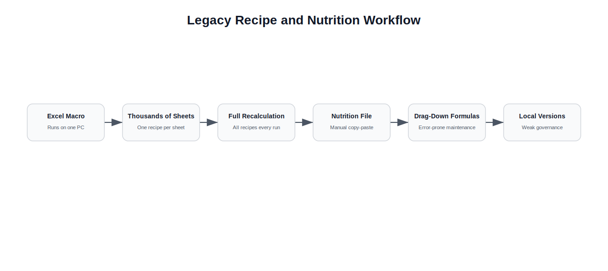
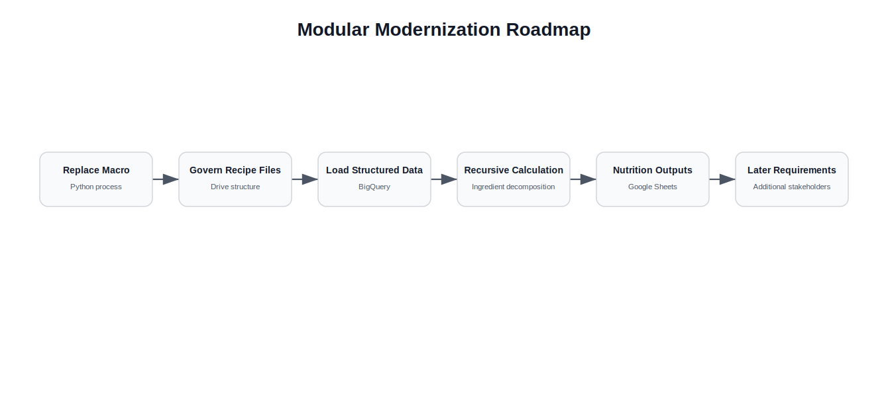
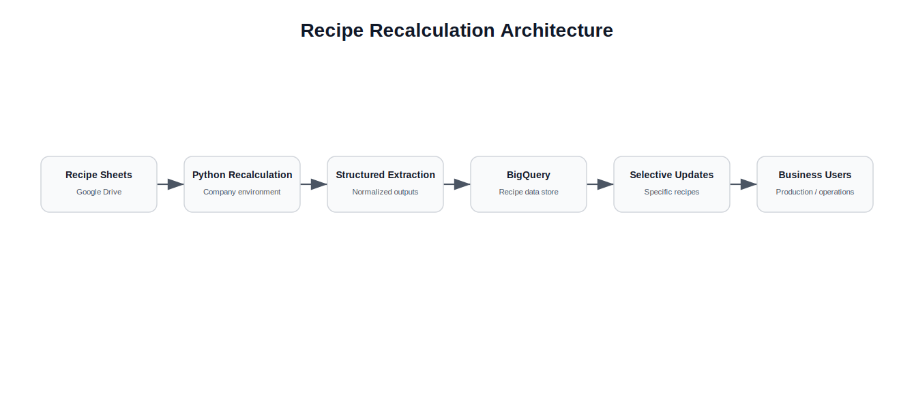
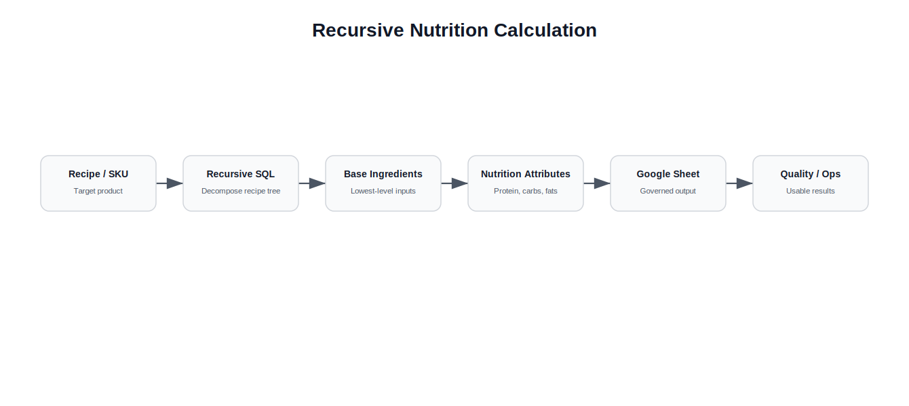

# Modularizing a Legacy Recipe and Nutrition System

## Executive Summary

This case study documents the modernization of a legacy recipe recalculation and nutritional table workflow.

The original process depended on a large Excel macro, thousands of recipe sheets and local spreadsheet files used to calculate nutritional information.

The project had a reputation for being difficult to complete.

Previous attempts struggled because they tried to build one large system that solved every requirement at once.

The successful approach was different.

Instead of trying to solve everything in a single release, the problem was decomposed into smaller modules that could be built, validated and expanded over time.

The result was a Python-based system that replaced the fragile macro workflow, moved recipe calculations into a more governed environment, stored structured results in BigQuery and supported nutritional calculations through connected Google Sheets.

---

# Context

Fork managed a large number of recipes across production.

Each recipe was stored as an Excel sheet inside a large workbook.

The workbook included a macro that reviewed the recipe sheets and calculated the quantities required to produce each recipe.

A separate Excel file was used to prepare nutritional tables.

Information from recipes was copied into the nutritional table file to calculate nutritional content, traces, allergens and related product information.

This created a fragile workflow with high operational dependency on local files, manual spreadsheet handling and specific users.

---

# The Original Workflow

The original process had two main subprocesses.

  

## 1. Recipe Recalculation Macro

A large Excel workbook contained thousands of sheets.

Each sheet represented a recipe.

A macro reviewed those sheets and calculated the required ingredient quantities for each recipe.

The process had several limitations:

- the macro only worked on one specific computer
- the process depended on that computer being available
- if the responsible person was away, the computer still had to be used
- the macro was slow
- the macro recalculated all recipes at once
- archived recipes stayed in the file because they could potentially be reactivated
- the macro used recipe names instead of SKUs, making it vulnerable to naming errors

## 2. Nutritional Table Spreadsheet

A separate Excel file was used to calculate nutritional tables.

This process also had limitations:

- recipe information was copied and pasted manually
- formulas had to be dragged down manually
- local file versions could diverge
- each recipe required a separate file for backup
- formula errors could appear if formulas were not extended correctly
- governance was weak because files existed locally

---

# The Problem

The main problem was not only technical.

The project was blocked because the scope was too broad.

Previous attempts tried to create a large system that solved every problem at once.

That created too many fronts:

- recipe recalculation
- recipe storage
- archived recipe handling
- nutritional calculations
- trace and allergen calculation
- quality-control requirements
- formula maintenance
- file version control
- user access and governance

Trying to solve all of these at the same time made the project hard to move forward.

The key decision was to break the problem into smaller battles.

---

# Strategy: Modularize the Problem

The project was approached as a long-term modernization effort.

Instead of designing a large system from the beginning, the work was divided into smaller modules:

1. replace the Excel macro with Python
2. move recipe files into a governed Drive structure
3. preserve the familiar recipe spreadsheet format
4. extract recipe data into BigQuery
5. calculate ingredient decomposition using recursive SQL
6. connect BigQuery outputs to Google Sheets
7. modernize nutritional table calculations
8. reduce manual formula maintenance through dynamic formulas
9. expand the system over time for additional stakeholders

This allowed progress to happen without waiting for every requirement to be solved at once.

  

---

# Solution Overview

The first major step was to replace the Excel macro with a Python-based recalculation process.

The new process was designed to run in the company environment and be accessible to company users, rather than depending on one local computer.

Recipe files were moved to Google Drive.

Each recipe remained as a spreadsheet, preserving the familiar format used by production.

The Python process extracted the recipe information and loaded structured outputs into BigQuery.

Once the data was in BigQuery, recursive SQL logic was used to calculate ingredient composition across recipes.

This allowed the system to determine, for a selected product, how much of each ingredient it contained and therefore calculate nutritional values such as:

- protein
- carbohydrates
- fats
- traces
- allergens
- other nutritional components

The process could also update specific recipes or groups of recipes instead of recalculating the full universe every time.

---

# Architecture

  

---

# BigQuery and Recursive Recipe Calculation

One of the most important technical improvements was moving recipe information into BigQuery.

Recipes could contain ingredients, intermediate preparations or other recipe components.

This created a hierarchical structure where one product could depend on several nested recipes.

Recursive SQL made it possible to decompose a recipe until reaching its base ingredients.

  

This allowed the system to calculate the nutritional composition of a product from its underlying recipe structure.

Instead of manually copying data into nutritional files, the calculation could be supported by structured recipe data and reusable queries.

---

# Governed Google Sheets Interface

After the recipe recalculation process was improved, the next step was to modernize the nutritional table workflow.

The BigQuery outputs were connected to Google Sheets.

This provided a lightweight and familiar interface without building a dedicated frontend.

Using Google Sheets also improved governance:

- the file was online
- access could be managed by company email
- there was one controlled version
- BigQuery remained the source of structured data
- formulas could be maintained centrally

Dynamic formulas such as `ARRAYFORMULA` reduced the risk of spreadsheet errors caused by formulas not being dragged down correctly.

This made the nutritional table workflow more reliable while preserving a tool that business users already understood.

---

# Key Engineering Decisions

## 1. Replace the Macro With Python

The Excel macro was fragile, slow and tied to one computer.

Python made the process more portable, faster and easier to maintain.

---

## 2. Preserve the Existing Recipe Format

Instead of forcing users to adopt a completely new system immediately, recipes remained in a spreadsheet format similar to the original workflow.

This reduced adoption friction.

---

## 3. Use BigQuery as the Calculation Layer

BigQuery allowed recipe information to be stored and queried in a structured way.

It also enabled recursive calculations that were difficult to manage safely in Excel.

---

## 4. Update Specific Recipes Instead of Everything

The original macro recalculated the full recipe universe.

The new system could update specific recipes or groups of recipes.

This made the process faster and more operationally practical.

---

## 5. Use Google Sheets as a Lightweight Interface

A full frontend was not required.

Google Sheets provided a governed and familiar interface for nutritional tables while BigQuery handled the structured data layer.

---

## 6. Manage Scope Through Modular Delivery

The project was intentionally divided into smaller deliverables.

This made it possible to create progress in a project that had previously stalled because it tried to solve too much at once.

---

# Stakeholder Management

One of the most difficult parts of the project was expectation management.

Different areas had different needs.

Some stakeholders expected early versions of the system to solve requirements that were planned for later phases.

This created tension because the first modules did not immediately cover every area.

The main challenge was explaining:

- what was being solved first
- why that order was chosen
- what would come later
- why some requirements were not yet covered
- how the modular roadmap would eventually address the broader problem

This was especially important for areas that depended on nutritional, traceability or quality-control outputs.

The lesson was that modular delivery requires not only technical sequencing but also clear communication.

---

# Results

The system improved the original workflow by replacing a fragile local macro with a more modular and governed process.

It enabled:

- Python-based recipe recalculation
- company-environment execution instead of one-PC dependency
- recipe files managed through Google Drive
- structured recipe data in BigQuery
- recursive ingredient decomposition
- selective recipe updates
- connected nutritional table workflows
- governed access through Google Sheets
- reduced local file version problems
- reduced formula maintenance issues

The project also changed the way the broader problem was approached.

Instead of treating the recipe and nutritional workflow as one large unsolved system, it became a set of smaller modules that could be improved over time.

---

# Lessons Learned

## 1. Large Problems Need Smaller Battlefields

The project had stalled because previous attempts tried to solve every requirement at once.

Breaking the problem into smaller modules made progress possible.

---

## 2. Modernization Does Not Always Require a Full Application

A dedicated frontend was not necessary.

Python, BigQuery, Google Drive and Google Sheets were enough to modernize the workflow and reduce operational fragility.

---

## 3. Preserve Familiar Interfaces When Adoption Matters

Keeping recipes in a familiar spreadsheet structure reduced friction for production users.

The system changed the backend process without forcing a complete behavioral change upfront.

---

## 4. Recursive Data Problems Need the Right Layer

Recipe decomposition was difficult to manage with Excel formulas and macros.

BigQuery and recursive SQL provided a better layer for hierarchical ingredient calculations.

---

## 5. Expectations Need to Be Managed as Carefully as Code

A modular roadmap can frustrate stakeholders if they expect their needs to be solved immediately.

Technical sequencing must be paired with clear communication about scope and priorities.

---

# What I Would Do Differently Today

Looking back, several aspects of the system could be improved.

## Build a Formal Recipe Data Model Earlier

A stronger data model for recipes, ingredients, intermediate products and final products would make the system easier to extend.

---

## Add a Validation Interface

A lightweight review workflow could allow users to validate recipe extraction errors, missing ingredients or inconsistent units.

---

## Create a Semantic Layer for Nutritional Fields

Nutritional calculations would benefit from clear definitions for each nutritional component, allergen and trace field.

---

## Add Monitoring for Broken Recipes

The system could detect recipes with missing ingredients, invalid units, circular dependencies or incomplete nutritional data.

---

## Formalize the Roadmap With Stakeholders

The modular approach worked, but stakeholder expectations could have been managed better with a clearer public roadmap and phase definitions.
