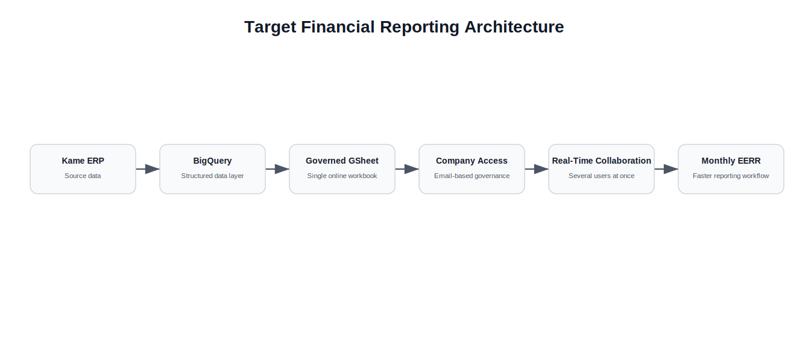
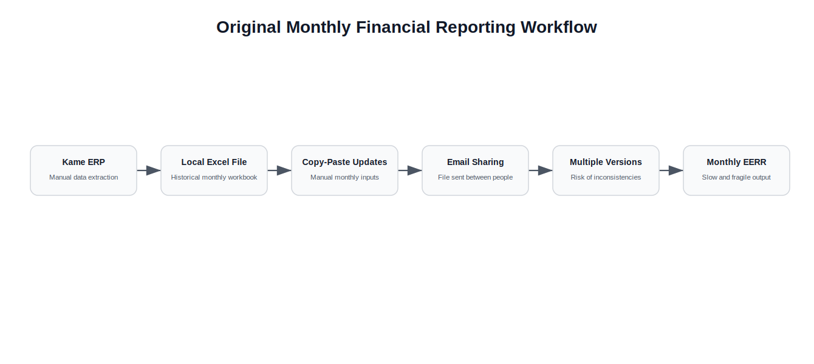
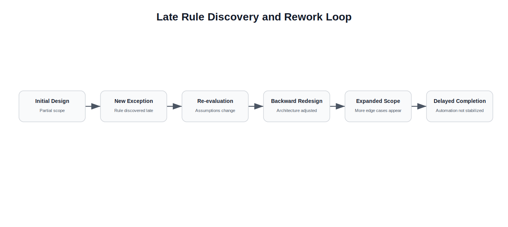
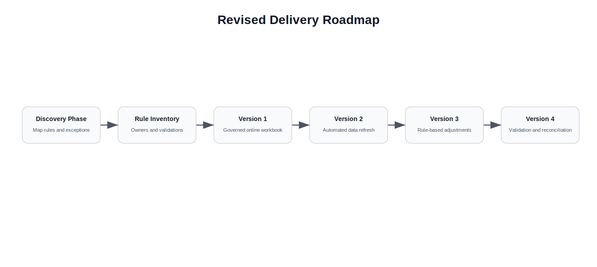

# Financial Reporting Automation Postmortem


## Executive Summary

This case study documents an attempt to automate and optimize the monthly financial statement reporting process.

Unlike the other case studies in this repository, this project did not reach a complete successful outcome before I left the company.

It is included as an engineering postmortem because it produced important lessons about scope definition, hidden business rules, stakeholder alignment and the limits of automation when requirements are not fully understood upfront.

The original process depended on manual ERP data extraction, a slow local Excel workbook, monthly copy-paste operations and email-based file sharing.

The goal was to modernize the workflow using the same cloud-based approach that had worked in previous projects: BigQuery for structured data management, Google Sheets for online collaboration and governed access through company accounts.

Some improvements were achieved.

Part of the workflow moved to Google Sheets, the spreadsheet became faster, and some data sources were integrated into BigQuery.

However, the project did not become a complete financial reporting automation before the timeline ended.

The main issue was not the technical direction.

The main issue was that the scope, rules and exceptions of the reporting process were not clearly defined from the beginning.

The main lesson was that financial reporting automation is not only a data pipeline problem.

It is a business-rule discovery problem.

---

# Context

The request came from the finance and production management area.

The company prepared monthly financial statement reports using a workflow that combined ERP information from Kame with a local Excel file.

The Excel file accumulated historical data and monthly inputs.

Over time, it became slow and difficult to maintain.

The file was also transferred between people by email, which created the risk of multiple versions being edited or used at the same time.

The intention was to modernize the workflow by using cloud-based tools that had already shown value in previous projects.

The target direction was:

```text
Kame ERP
|
BigQuery
|
Google Sheets
|
Online governed financial reporting workflow
```

<p align="center">
  
</p>

The expected benefits were:

- faster spreadsheet performance
- fewer local file dependencies
- online collaboration
- governed access through company accounts
- better data management in BigQuery
- less manual copy-paste work
- lower risk of multiple file versions

---

# The Original Workflow

The original monthly EERR process depended on several manual steps.

<p align="center">
  
</p>

Data was extracted from the Kame ERP.

That information was then copied into a local Excel workbook.

The workbook contained monthly data, formulas and reporting logic.

The file was shared between people by email during the preparation process.

This created several issues:

- slow spreadsheet performance
- manual data extraction
- repeated copy-paste operations
- local file dependency
- multiple file versions
- unclear ownership during monthly preparation
- difficulty collaborating in real time
- high risk of inconsistent inputs

The process was operationally important, but technically fragile.

---

# What We Tried to Build

The goal was to move the workflow toward a more governed and scalable structure.

The intended architecture was based on three main components.

## 1. BigQuery as the Structured Data Layer

BigQuery would store and organize the data needed for the reporting process.

This would reduce the dependency on manual spreadsheet storage and make financial information easier to query and manage.

## 2. Google Sheets as the Collaborative Interface

Google Sheets would replace the local Excel workflow as the user-facing interface.

This would allow several people to work on the same controlled file instead of sending versions by email.

## 3. Governed Access Through Company Accounts

Access would be controlled through company email accounts.

This would reduce unauthorized access and improve version control.

---

# Partial Outcome

The project did not fully automate the monthly EERR process, but it still produced useful progress.

The workflow moved in the right direction by reducing dependence on the original local Excel file and introducing cloud-based components for data management and collaboration.

The partial outcome included:

- a faster spreadsheet workflow
- movement toward a single online version
- Google Sheets as a collaborative interface
- BigQuery integration for selected reporting inputs
- better understanding of the hidden complexity behind the EERR process
- clearer awareness that the reporting workflow needed formal rule discovery before full automation

The incomplete result was valuable because it exposed the real nature of the problem.

The bottleneck was not only data extraction.

It was the lack of an explicit, validated and complete map of the financial reporting rules.

---

# What Worked

The project did achieve partial improvements.

Some parts of the workflow were moved to Google Sheets.

Spreadsheet performance improved compared with the original local workbook.

Some databases and reporting inputs were integrated into BigQuery.

The project also helped clarify that the existing process had more hidden logic than originally expected.

That discovery was important.

It showed that the project required a stronger discovery and rule-mapping phase before a full automation layer could be safely implemented.

These improvements were useful, but they were not enough to complete the full automation.

---

# What Did Not Work

The project did not reach a complete automated monthly EERR workflow before I left the company.

The main reason was not the lack of technical tools.

The main reason was incomplete business-rule discovery.

Several reporting rules, exceptions and process details appeared only during implementation.

Each new rule forced the system to be reconsidered.

In many cases, solving the new issue was not enough.

The underlying design also had to be made more robust so that similar future changes would not break the workflow.

This created repeated backward redesign.

<p align="center">
  
</p>

The project kept expanding because the boundaries of the final deliverable were not clear enough from the beginning.

---

# Root Causes

## 1. Incomplete Scope Definition

The full scope of the reporting process was not mapped before development started.

The project began with a general target, but not with a complete list of rules, exceptions, ownership points and required outputs.

## 2. Hidden Business Rules

Several important reporting rules were discovered late.

This made the system harder to stabilize because each discovery changed assumptions that had already been used in the design.

## 3. Overconfidence From Previous Projects

Previous successful projects created confidence that this project would be easier to execute.

That confidence was reinforced by a strong working relationship with the internal sponsor.

However, working well with someone as a manager is different from working with that person as the client of a complex business-rule automation project.

## 4. Weak Client-Developer Boundary

Because the sponsor was also the direct manager, the project lacked a clear boundary between request definition, prioritization, validation and delivery.

This made it easier for scope changes and missing details to appear informally during development.

## 5. Financial Reporting Complexity

Financial reporting workflows contain many exceptions.

Those exceptions are often embedded in spreadsheet habits, manual adjustments and month-end routines.

They are difficult to automate unless they are explicitly documented and validated.

---

# Business Impact

Even though the project did not reach full automation, it had business value.

It showed that the finance reporting process had accumulated hidden operational knowledge inside manual spreadsheet routines.

The project helped reveal that:

- the EERR workflow was more complex than it looked from the outside
- several financial rules were informal or undocumented
- manual month-end adjustments needed to be mapped before automation
- cloud tools could improve collaboration, but not replace unclear process ownership
- a reliable financial reporting automation required formal rule validation

The business lesson was that automation should not only optimize the visible workflow.

It should also make the invisible rules explicit.

---

# Technical Lessons

## 1. Financial Reporting Automation Requires Rule Discovery First

Before building pipelines or spreadsheets, the reporting logic needs to be mapped.

This includes:

- source systems
- manual adjustments
- exceptions
- month-end rules
- ownership
- validation steps
- expected outputs
- reconciliation logic

Without this, the technical system is built on unstable assumptions.

## 2. Hidden Exceptions Create Backward Rework

Every hidden rule discovered late can force redesign.

The issue is not only patching one case.

The issue is making the system robust enough to handle that class of cases in the future.

## 3. Cloud Tools Do Not Solve Undefined Processes

BigQuery and Google Sheets improved parts of the workflow, but they could not solve unclear business logic by themselves.

Good tooling helps, but it cannot replace process clarity.

## 4. Automation Should Follow Stabilization

A process should be stabilized before it is automated.

If the process is still being discovered during development, automation becomes harder and riskier.

---

# Stakeholder and Scope Lessons

## 1. A Good Sponsor Still Needs Clear Requirements

A strong relationship with a manager or stakeholder does not replace formal requirement discovery.

The project still needs clear rules, boundaries and validation criteria.

## 2. The Client Role Must Be Explicit

When the request comes from a direct manager, it is important to define when that person is acting as manager, sponsor, client or reviewer.

Those roles have different responsibilities.

## 3. Definition of Done Matters

The project needed a clearer definition of completion.

Without a clear definition of done, it became difficult to determine whether the project was progressing toward a stable deliverable or continuously expanding.

## 4. Exceptions Should Be Collected Before Building

For reporting workflows, exception gathering should be a formal phase.

It is not enough to model the happy path.

The month-end edge cases are often where the real process lives.

---

# What I Would Do Differently Today

Looking back, I would approach the project differently.

## Start With a Discovery Phase

Before building, I would document the full reporting workflow.

This would include interviews, process mapping, file review, exception collection and ownership mapping.

## Create a Rule Inventory

I would create a formal inventory of business rules and exceptions.

Each rule would include:

- source
- owner
- input data
- output impact
- validation logic
- example months where it applies

## Build a Minimal Reconciliation Model First

Instead of starting with broad automation, I would first build a reconciliation model that compares ERP data, spreadsheet outputs and expected report results.

This would expose gaps before replacing the workflow.

## Define the First Version More Narrowly

The first deliverable should have had a narrower scope.

For example:

```text
Version 1: online governed reporting workbook with BigQuery-fed inputs
Version 2: automated data refresh
Version 3: rule-based adjustments
Version 4: validation and reconciliation layer
```

<p align="center">
  
</p>

## Establish Formal Sign-Off

Each reporting rule and output should have had explicit stakeholder approval.

That would reduce the risk of discovering critical rules late in the development process.

---

# Final Takeaway

This project taught me that failed or incomplete automation projects can still produce valuable engineering lessons.

The technical direction was reasonable.

Moving from local Excel files and email-based sharing toward BigQuery and governed Google Sheets was the right direction.

The problem was that the business logic was not explicit enough before implementation.

The most important lesson was:

> You cannot fully automate a process that has not been fully understood.

For financial reporting, the hardest part is often not extracting the data.

It is discovering the rules that people apply manually, informally and repeatedly during the month-end process.

This case changed the way I think about automation.

Before automating a complex business process, the first deliverable should be understanding the process well enough to define its rules, exceptions, owners and validation criteria.
