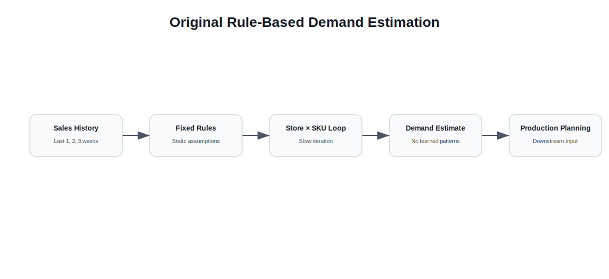
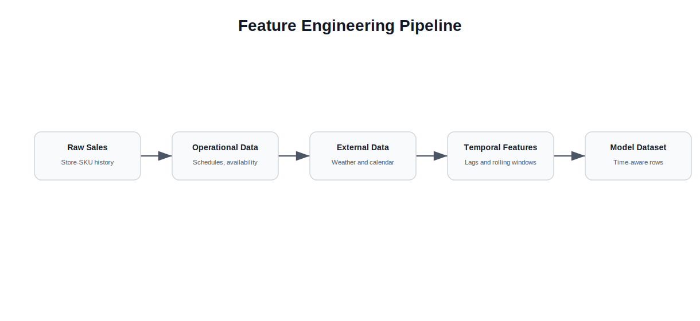
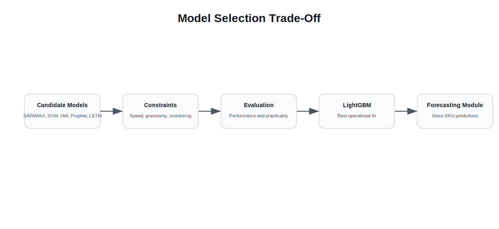
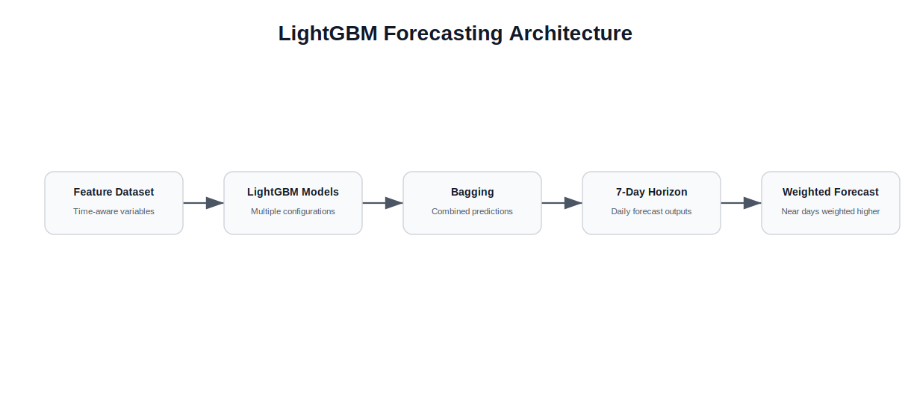

# Demand Forecasting Modernization with LightGBM


## Executive Summary

This case study documents the modernization of a demand forecasting module inside a larger production planning codebase.

The original planning system was organized around five large code modules, each responsible for a specific part of the production planning workflow.

One of the most important modules was the demand estimation module.

Although it was called a forecasting process, it was closer to a rule-based calculation algorithm.

It used fixed assumptions based on sales from the previous one, two and three weeks to estimate future store-level sales.

The system did not learn from historical data in a statistical or machine learning sense.

It also ran slowly because it iterated product by product and store by store across a large operational matrix of sellable SKUs, stores, opening hours, product availability rules and store-specific product mixes.

The goal was to replace this static and slow logic with a model that could learn from historical demand patterns while still being fast enough to run at store-SKU granularity.

After evaluating several forecasting approaches, LightGBM was selected because it offered the best balance between speed, granularity, predictive performance, low monitoring overhead and understandable tuning.

---

# Context

Fork operated a production planning process that needed to estimate how much demand could be expected across multiple stores and products.

The planning environment involved:

- up to roughly 200 sellable SKUs
- 16 stores
- different store opening and closing schedules
- store-specific product availability
- different product mixes by store
- operational restrictions on what each store could sell
- historical sales behavior that varied by product and location

The forecasting module was only one part of a broader planning system.

However, it was a critical part because demand estimates influenced downstream production planning decisions.

---

# The Original Demand Estimation Logic

The original module was not a true forecasting model.

<p align="center">
  
</p>

It was a rule-based algorithm built around recent sales windows.

The logic estimated expected demand using sales from the previous:

- 1 week
- 2 weeks
- 3 weeks

These rules existed because they had been defined by the people who originally designed the process.

However, the algorithm did not learn from data.

It did not evaluate patterns across longer historical windows.

It did not adapt based on store behavior, product behavior, weather, calendar patterns or changes in demand dynamics.

It also processed the problem through slow nested iterations.

Conceptually, the process looked like this:

```text
for each store:
    for each sellable SKU:
        apply fixed recent-sales rules
        calculate expected demand
```

At operational scale, this became slow and difficult to improve.

---

# The Problem

The forecasting module had two main problems.

## 1. It Did Not Learn From Historical Data

The model relied on fixed rules instead of learning from past behavior.

This limited its ability to adapt to:

- seasonality
- product-level patterns
- store-level patterns
- weather effects
- calendar effects
- demand volatility
- changes in store performance

The result was a demand estimate based more on static assumptions than on learned historical relationships.

## 2. It Was Too Slow at Operational Granularity

The system needed forecasts at store-SKU level.

This meant potentially evaluating many product and store combinations.

The original implementation was slow because it processed the calculation product by product and store by store.

A better solution needed to be both more predictive and faster.

---

# Modeling Requirements

The replacement model needed to satisfy several practical requirements.

It had to:

- operate at store-SKU granularity
- run fast enough for planning workflows
- require limited ongoing monitoring
- support many product and store combinations
- learn from historical sales patterns
- incorporate operational variables
- avoid excessive fine-tuning
- be understandable enough for operational use

A key constraint was monitoring.

A demand forecasting model creates new operational work because its outputs need to be questioned, reviewed and improved over time.

However, the model had to minimize the amount of required monitoring because the organization was unlikely to maintain a heavy model governance routine.

---

# Feature Engineering

A significant part of the project was creating the right data structures.

<p align="center">
  
</p>

The model required more than historical sales.

New input tables and variables were created, including:

- historical demand data
- store opening and closing schedules
- store categories
- product availability by store
- weather data
- calendar variables
- normalized time-based features
- rolling demand windows
- lagged sales variables
- rolling averages
- rolling variability metrics

Weather data was collected through automated extraction from an aeronautical weather source.

Calendar variables were transformed so they could be used more effectively by the model.

For example, days of the week could be encoded cyclically instead of being treated as unrelated numeric values.

This helped represent weekly patterns more naturally.

---

# Temporal Feature Design

The first versions of the model performed poorly.

The reason was that the data was temporally disconnected from the model's perspective.

The model saw each row as an independent observation.

It did not automatically understand that rows belonged to a time sequence.

To solve this, temporal features were added.

These included variables such as:

- sales from the previous 7 days
- rolling average sales
- rolling sales variability
- lagged sales windows
- weekly historical behavior
- longer historical reference windows when data was available

This transformed the dataset.

Instead of expecting the model to infer time dependency from row order, the time dependency was encoded directly into the features.

This allowed the model to learn how past sales behavior influenced current and future demand.

The improvement significantly reduced forecast error.

---

# Model Evaluation

Several model families were evaluated or considered.

<p align="center">
  
</p>

These included:

- SARIMAX variants
- SVM
- Holt-Winters variants
- Prophet
- LSTM neural networks
- LightGBM

Many alternatives were discarded because they did not fit the operational constraints.

Some were too slow.

Some did not scale well to the required store-SKU granularity.

Some required too much fine-tuning.

Some behaved too much like black boxes for the level of monitoring and operational trust available at the time.

LightGBM provided the best balance.

It was fast, flexible, relatively easy to tune and capable of handling the structured feature set created for the problem.

---

# Why LightGBM Was Selected

LightGBM was selected because it provided the best practical trade-off.

It allowed:

- fast training and prediction
- store-SKU-level modeling
- strong performance on tabular data
- use of engineered temporal features
- relatively low fine-tuning overhead
- easier operational understanding compared with more complex alternatives
- better performance than the previous rule-based algorithm

The goal was not to choose the most theoretically sophisticated forecasting method.

The goal was to choose the method that best matched the operational problem.

---

# Ensemble and Forecast Horizon Strategy

The final approach used a form of bagging.

Multiple LightGBM models were trained with different tuning configurations.

Their outputs were combined to produce a more stable forecast.

The model generated forecasts for the following seven days.

Those forecasted days were then weighted.

Nearer forecast days were treated as more reliable.

Farther forecast days were treated as less certain.

Conceptually:

```text
multiple LightGBM models
|
7-day forecast horizon
|
higher weight for near-term days
|
lower weight for farther days
|
combined expected demand
```

<p align="center">
  
</p>

This helped moderate the uncertainty of forecasting several days ahead while still giving the planning process a forward-looking demand estimate.

---

# Performance Comparison

The proposed LightGBM-based approach was compared against the existing rule-based algorithm.

The comparison considered both prediction quality and code performance.

The model showed better results when evaluated against historical outcomes.

R2 was used as one of the comparison metrics.

The LightGBM approach also improved execution performance compared with the original product-by-product, store-by-store calculation logic.

The result showed that the existing module could be improved both analytically and computationally.

---

# Adoption Challenge

The main challenge was not only technical.

Even with better measured performance, adoption was difficult.

The existing algorithm was known to be limited, slow and inaccurate in several ways.

However, it was familiar.

The new model required people to trust a different approach.

This created a classic adoption problem:

> Better technical performance does not automatically create organizational adoption.

The project showed that a model only creates impact when people are willing to trust it, monitor it and change the operating process around it.

---

# Key Engineering Decisions

## 1. Treat the Original Forecast as a Rule-Based Algorithm

The first important decision was to stop treating the existing process as a true forecasting model.

It was a rule-based calculation system.

That distinction mattered because it clarified the real opportunity: replacing static assumptions with a learning-based approach.

---

## 2. Engineer Temporal Features Explicitly

LightGBM does not automatically understand time order from row sequence.

Temporal dependency had to be encoded through lag variables, rolling averages, rolling variability and historical demand windows.

This was one of the most important improvements in the project.

---

## 3. Prioritize Operational Fit Over Theoretical Complexity

Several models were evaluated or considered.

LightGBM was selected because it fit the operational constraints better than alternatives that required more tuning, more monitoring or more computational overhead.

---

## 4. Use an Ensemble for Stability

Multiple LightGBM configurations were combined to moderate forecast behavior.

This helped reduce dependency on a single model configuration.

---

## 5. Weight the Forecast Horizon

Forecasts for closer days were treated as more reliable than forecasts for farther days.

This reflected the practical uncertainty of planning several days ahead.

---

# Results

The project demonstrated that the original demand estimation module could be improved with a machine learning approach.

It enabled:

- faster demand estimation
- store-SKU-level forecasting
- richer feature engineering
- incorporation of store schedules
- incorporation of product availability
- incorporation of weather and calendar data
- better use of historical demand patterns
- evaluation against the existing rule-based algorithm
- measurable comparison using performance metrics such as R2

The project also revealed that technical superiority is not enough.

The strongest technical solution still needs stakeholder trust, process adoption and ongoing monitoring to create business impact.

---

# Lessons Learned

## 1. Forecasting Is Not Just a Model Choice

The most important work was not simply selecting LightGBM.

The most important work was creating the data structures and features that allowed the model to learn from the past.

---

## 2. Tabular Models Need Time-Aware Features

When using a tabular model for forecasting, time dependency must be encoded.

Lag features and rolling windows transformed disconnected rows into useful temporal context.

---

## 3. Operational Constraints Matter

The best model is not always the most sophisticated model.

The best model is the one that performs well within the real constraints of speed, monitoring, maintainability and adoption.

---

## 4. Adoption Is Part of the System

A forecasting model only matters if the organization uses it.

Better accuracy does not automatically overcome familiarity with the old process.

---

## 5. Do Not Fall in Love With the Solution

A technically better solution can still fail to create impact if people do not adopt it.

The project reinforced the importance of separating technical pride from organizational reality.

---

# What I Would Do Differently Today

Looking back, several aspects of the project could be improved.

## Create a Formal Backtesting Framework

The model should have had a structured backtesting framework comparing forecasts across multiple historical windows, products and stores.

## Add Model Monitoring

Forecast errors should be monitored over time by store, SKU, product category and forecast horizon.

## Build Trust Through Pilot Deployment

A controlled pilot with a small group of stores and SKUs could have helped build confidence before proposing broader adoption.

## Improve Explainability

Feature importance and example forecast explanations could have helped stakeholders understand why the model behaved differently from the old algorithm.

## Define Ownership

The model needed a clear owner responsible for reviewing performance, updating assumptions and deciding when retraining or adjustment was required.

---

# Final Takeaway

The project showed that machine learning can improve operational planning, but only when the data, features, performance requirements and adoption process are designed together.

LightGBM solved many of the technical constraints.

It was fast, accurate enough, flexible and suitable for store-SKU-level forecasting.

But the broader lesson was human.

A better model does not replace the need for trust, monitoring and organizational willingness to change.

The real success of a forecasting system depends not only on prediction quality, but on whether people are willing to use it to make decisions.
